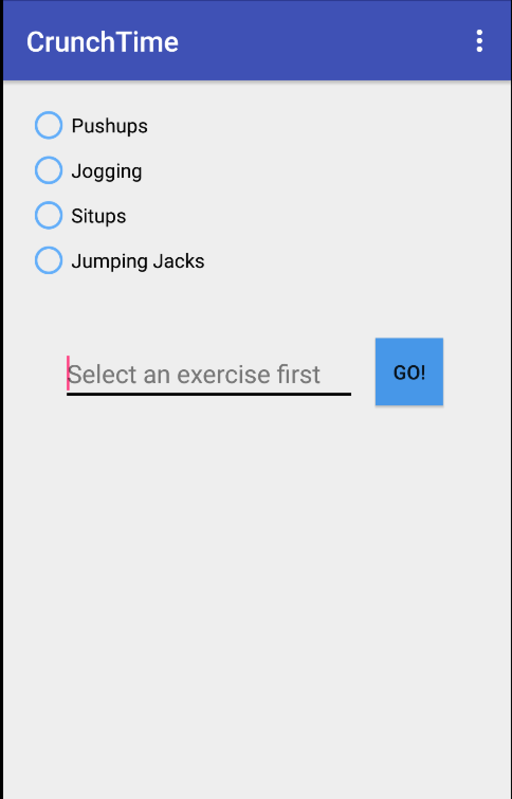
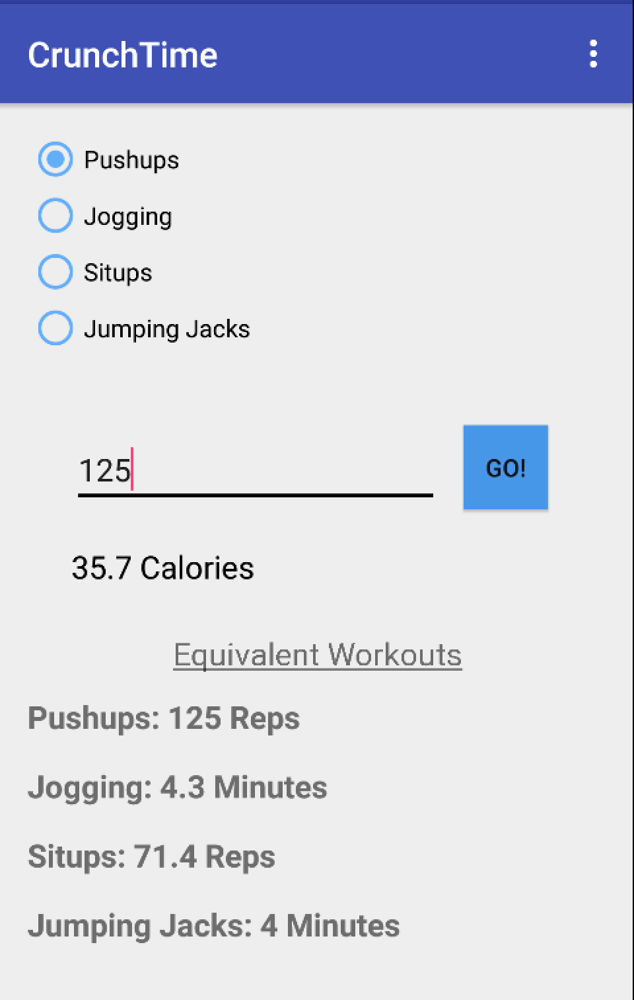
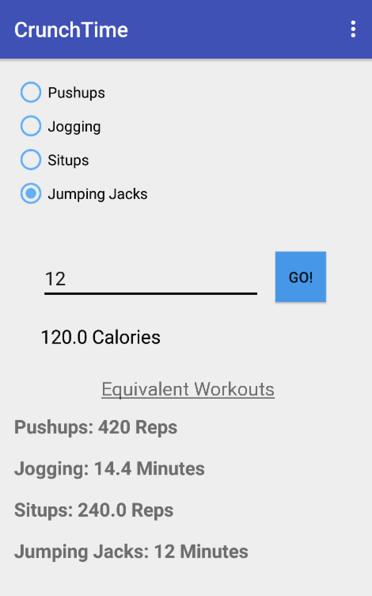

# PROG 01: Crunch Time

Crunch Time is an app that helps people lose weight by converting exercise to calories.  It is a simple interface that given the amount of time exercised or reps performed, will output the number of calories burned.  The application also displays similar exercises along with the equivalent workouts.

## Authors

Daniel Dobalian  ([ddobalian@berkeley.edu](mailto:ddobalian@berkeley.edu))

## Demo Video

See [Crunch Time Walkthrough] (https://youtu.be/pXHRwDPg9QU)

## Screenshots

## Acknowledgments

http://codehandbook.org/a-simple-android-application-for-adding-two-numbers/ for a quick explanation on how to build simple apps. 

